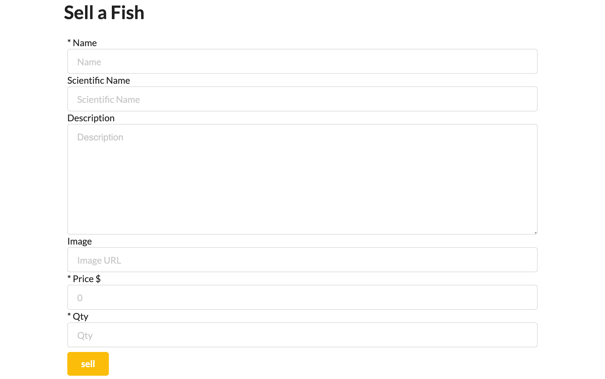

# Zach's Fish House

https://zachs-fish-house.herokuapp.com/

Zach's Fish House is your go to marketplace to sell and buy your fish. It is a full CRUD app adhering to the MVC file structure and uses all 7 RESTful routes. Some challenges I had along the way were sessions and authorization. Once I managed to get that all sorted out I wanted to take it a step further and make the experience user specific. I set it up so that the only person that can edit or delete a fish is the user that created it and me. I also had trouble setting it up so that if a username was already in the database it would prompt the user to pick a different username when registering. I still have yet to set that up. If I had more time I would make a shopping cart section and add more styling.

---
## Technologies I Used

- Node.js
- Express
- ejs
- Mongoose
- MongoDB
- CSS 3
- JavaScript ES6
- Bootstrap
- Semantic UI

---

